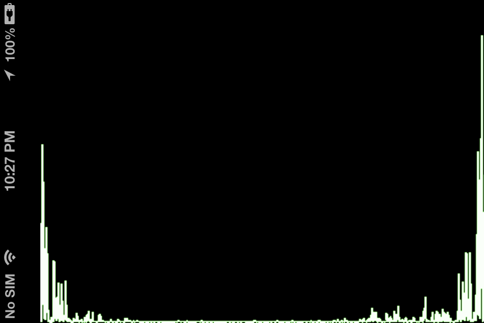

Mozart is a simple sound spectrum analyzer that uses the remote I/O audio unit for sampling audio input and process it with Apple's Accelerate framework fast Fourier transforms.

Mozart is inspired in Apple's iOS SDK sample [AurioTouch](http://developer.apple.com/library/ios/#samplecode/aurioTouch/Introduction/Intro.html)

